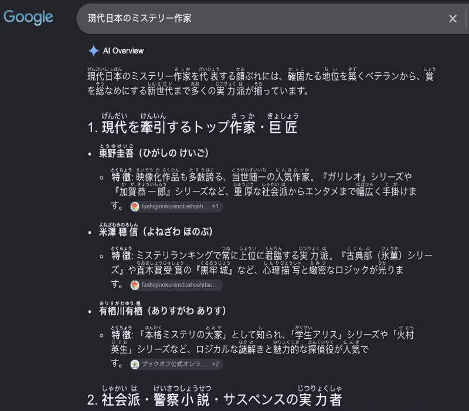
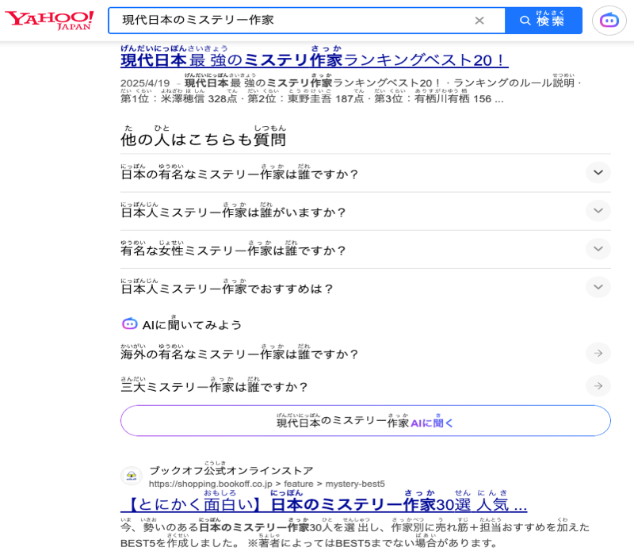

<h1 align="center">
  
  <br/>
  Fast Furigana
</h1>

<p align="center">
  <b>Ultra-fast, lightweight Japanese Furigana injector for Google Chrome.</b>
</p>

<p align="center">
  
  
</p>

## Highlights

- **Blazingly Fast**: Real-time Japanese morphological parsing with zero-latency in-memory caching.
- **Instant Toggle (`Alt+F`)**: Toggle between Furigana and original text with one click or `Alt+F` (`Option+F` on macOS).
- **Smart Filtering**: Automatically detects Japanese pages and strictly excludes Chinese/Korean websites.
- **Rich Markup Support**: Seamlessly preserves readings on Google Search highlights (`<em>`), links, and styled text.
- **100% Offline & Private**: All morphological processing runs locally on-device. Zero network requests or tracking.

## Installation

1. Download the latest `fast-furigana-vX.Y.Z.zip` from [Releases](https://github.com/activebook/fast-furigana/releases).
2. Unzip the archive to a local folder.
3. Open Chrome and navigate to `chrome://extensions/`.
4. Turn on **Developer mode** in the top-right corner.
5. Click **Load unpacked** and select the unzipped folder.

## Development

```bash
npm install        # Install dependencies
npm run build      # Compile extension bundle (dist/)
npm run package    # Package release zip
```

## License

[MIT](LICENSE)
